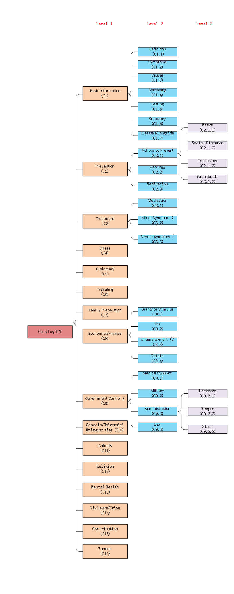

# IDIR COVID-19 Dataset

## **COVID19 Cases Data Collection**

### Setup your own case collection environment

1. Modify the configuration of `./covid_cases_collection/run_daily.sh` as your own.
2. Create a `crontab` job to schedule daily data collection task.

### Cases Data Sources

- [Johns Hopkins University](https://github.com/CSSEGISandData/COVID-19)
- [New York Times](https://github.com/nytimes/covid-19-data)
- [COVID Tracking Project](https://covidtracking.com/api/)

## **COVID19 Facts Dataset Overview**

### COVID19 Facts Statistics

- Data sources(websites) count: **29**
- Fact-check data sources count: **7**
- FAQ data sources count: **22**
- Fact-check entries count: **7983**
- FAQ entries count: **3194**
- Taxonomy-labelled entries count: **500**

### Statistic Details

\* means the data directly from the paper [“What Are People Asking About COVID-19? A Question Classification Dataset](https://openreview.net/forum?id=qd51R0JNLl)

1. **Claim Debunking Entries**

| Data Source            | Number of Entries |
|------------------------|-------------------|
| Poynter                | 7480              |
| PolitiFact             | 454               |
| News Guard             | 13                |
| Johns Hopkins Medicine | 4                 |
| In Total               | **7951**          |

2. **Fact-Only Entries**

| Data Source  | Number of Entries |
|--------------|-------------------|
| CDC          | 5                 |
| WHO          | 23                |
| World Vision | 4                 |
| In Total     | **32**            |

3. **Question-Answer Entries**

| Data Source            | Number of Entries |
|------------------------|-------------------|
| CDC                    | 290               |
| CNN\*                  | 65                |
| Coronavirus\.gov       | 435               |
| COVID\-19 Factcheck    | 23                |
| Doctors without Border | 6                 |
| ECDC                   | 47                |
| FDA\*                  | 60                |
| FEMA                   | 17                |
| Global Health Now      | 59                |
| IDPH\*                 | 20                |
| Johns Hopkins\*        | 12                |
| New York Times         | 119               |
| United Nations\*       | 25                |
| Washington Post        | 35                |
| WHO                    | 284               |
| WJLA\*                 | 16                |
| World Vision           | 16                |
| In Total               | **1529**          |

4. **Question-Only Entries**

| Data Source       | Number of Entries |
|-------------------|-------------------|
| Bing Search\*     | 91                |
| Keyword Tool\*    | 347               |
| Quora\*           | 1048              |
| Yahoo\*           | 128               |
| Yahoo Answers\*   | 51                |
| In Total          | **1665**          |

### COVID19 Facts Entries

All data files are Excel files. Each excel file stores data from one data source.  Each row in the file is an entry. There are 4 kinds of entries put in 4 different folders. The 4 kinds of entries are

1. **claim_debunking entries**: These entries are mostly misleading claims or myth, and most of which are collected from fact-checking websites. The columns that belong to Claim Debunking entries are:
    - “Outlet”: The platform/organization that posted the fact-checking result of the claim.
    - “Claimer”: The person/platform that the claim appears.
    - ”Fact-Checker”: The person who fact checked the claim, say, who checks  the claim and give it a verdict as false, true, misleading, mostly true, etc.
    - “Claim”: The claim made by the claimer.
    - “Verdict”: The judgement or decision given by the Fact-Checker/ Outlet to the claim.
    - “Fact/Summary”: The summary of the related facts to the claim.
    - “Answer/Detail”: The detail of the related facts to the claim. Can be pure text or a link to a debunking article.
    - “Taxonomy”: The taxonomy/class of the claim. The taxonomy is labelled like C2.1.1, the meaning of the taxonomy is shown in file taxonomy.vsdx.
    - “Source”: The url of the data source website of the entry.
    - “Retrieval Date”: The date when the entry was retrieved.

2. **question_answer entries**: These entries are all question-answer pairs collected from different data sources. The columns that belong to these entries are:
   - “Question”: The question related to COVID-19.
   - “Fact/Summary”: The summary of the original answer to the question. It can be regarded as the direct answer to the question.
   - “Answer/Detail”: The original answer to the question on the data source website, and it can be very long. If the original answer is very short, it will be put into the “Fact/Summary” column and will not appear in “Answer/Detail” Column.
   - “Source”: The url of the data source website or pure text (Excel files whose names end with “_paper.xlsx” whose “Source” is pure text, others are urls).
   - “Taxonomy”: The taxonomy/class of the question. The taxonomy is labelled like C2.1.1, the meaning of the taxonomy is shown in file taxonomy.vsdx.
   - “Retrieval Date”: The date when the entry was retrieved.

3. **question_only entries**: These entries are only questions related to COVID-19. They are all from the dataset of the paper [“What Are People Asking About COVID-19? A Question Classification Dataset](https://openreview.net/forum?id=qd51R0JNLl). The columns that belong to these entries are:
   - “Question”: The question related to COVID-19.
   - “Fact/Summary”: The answer to the question provided by the paper’s dataset.
   - “Source”: The data source of the questions, it is pure text provided by the paper’s dataset.
   - “Taxonomy”: The taxonomy/class of the question. The taxonomy is labelled like C2.1.1, the meaning of the taxonomy is shown in file taxonomy.vsdx.
   - “Retrieval Date”: The date when the entry was retrieved.

4. **fact_only entries**: These entries are only facts from different data sources. They are true for sure. The columns that belong to these entries are:
   - “Fact/Summary”: The fact related to COVID-19. It is true.
   - “Source”: The data source of the questions, it is pure text provided by the paper’s dataset.
   - “Taxonomy”: The taxonomy/class of the fact. The taxonomy is labelled like C2.1.1, the meaning of the taxonomy is shown in file taxonomy.vsdx.
   - “Retrieval Date”: The date when the entry was retrieved.

## COVID19 Facts Dataset Source Websites

1. Claim Debunking Websites:
   - [poynter.org](https://www.poynter.org/ifcn-covid-19-misinformation/)
   - [politifact.com](https://www.politifact.com/coronavirus/)
   - [Johns Hopkins Medicine](https://www.hopkinsmedicine.org/health/conditions-and-diseases/coronavirus/2019-novel-coronavirus-myth-versus-fact)
   - [NewsGuard](https://www.newsguardtech.com/covid-19-myths/#canadianlab)

2. Question-Answer Websites:
   - [WHO Q&A](https://www.who.int/emergencies/diseases/novel-coronavirus-2019/question-and-answers-hub)
   - [CDC FAQs](https://www.cdc.gov/coronavirus/2019-ncov/faq.html)
   - [ECDC FAQs](https://www.ecdc.europa.eu/en/covid-19/questions-answers)
   - [Coronavirus.gov FAQs](https://faq.coronavirus.gov)
   - [FEMA coronavirus rumors control](https://www.fema.gov/Coronavirus-Rumor-Control)
   - [New York Times FAQs](https://www.nytimes.com/interactive/2020/world/coronavirus-tips-advice.html)
   - [Washington Post FAQs](https://www.washingtonpost.com/health/2020/02/28/what-you-need-know-about-coronavirus/?arc404=true#what)
   - [Doctors without Borders](https://www.doctorswithoutborders.org/covid19)
   - [covid19factcheck.com](https://www.covid19factcheck.com/en/)
   - [Global Health Now](https://www.globalhealthnow.org/2020-02/coronavirus-expert-reality-check)
   - [World Vision](https://www.worldvision.org/disaster-relief-news-stories/what-is-coronavirus-facts)

3. Fact Only Websites:
   - [CDC Facts](https://www.cdc.gov/coronavirus/2019-ncov/daily-life-coping/share-facts.html)
   - [WHO Facts](https://www.who.int/emergencies/diseases/novel-coronavirus-2019/advice-for-public/myth-busters)
   - [World Vision](https://www.worldvision.org/disaster-relief-news-stories/what-is-coronavirus-facts)

## Taxonomy Figure

- The “taxonomy.vsdx” file shows the catalog of the taxonomy of the covid19 misinformation. In the excel files, the “taxonomy” column are symbols like “C2.1.1” and the meaning of the symbol can be found in “taxonomy.vsdx” file.
- The “taxonomy.vsdx” file might change later. Because we need to ask some experts in order to make sure that the catalog is reasonable.
- If an entry belongs to a level 2 class, but not belongs to any of its level 3 class, then the taxonomy of this entry will be the level 2 class. And so on for similar cases. If an entry doesn’t belong to any of the level 1 class, then its taxonomy will be “C”.

## Contributor

- [Xiao Shi](https://github.com/shixiao9941)
- [Jaradat Israa](https://github.com/ijaradat/)
- [Josue Caraballo](https://github.com/v3nd3774)
- [Kevin Meng](https://github.com/kmeng01)
- [Zhengyuan Zhu](https://github.com/824zzy)

## License

The work in this repository is released under the [GNU General Public License v3.0](./LICENSE).
